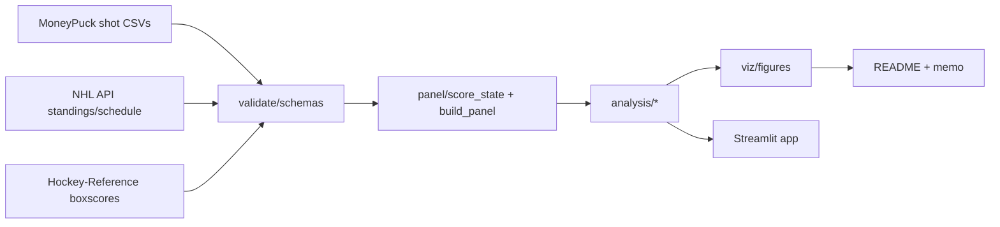

# The Loser Point: How the NHL Pays Teams to Stop Playing Hockey

> **Status: Phase 0 (scaffold) complete.** The empirical results below are
> placeholders until the data pipeline (Phases 1-6) is built. Nothing in this
> section should be cited until this notice is removed.

Since 2005-06 the NHL has awarded 2 points for any win, 1 point for an
overtime/shootout loss, and 0 for a regulation loss. A game that reaches
overtime distributes 3 points instead of 2. Two teams tied late in the third
period face a distorted incentive: play conservatively, reach overtime, and
both leave with a guaranteed point. This project measures that distortion
directly in shot-attempt data, tests whether it emerged with the 2005 rule
change, and quantifies its effect on standings and playoff berths.

## Why this matters beyond hockey

Payment structures change behavior, and the change is often invisible until
someone measures it directly against a matched counterfactual. The same
mechanism-design logic — a floor or bonus that kicks in near a threshold —
shows up in sales compensation plans, quota structures, and marketplace fee
schedules, and this project is a fully worked, verifiable example of finding
and sizing that kind of distortion in the wild.

## Key findings

*(to be filled in after Phase 2's go/no-go descriptive figure and Phase 3's
main model — see [docs/methodology.md](docs/methodology.md) for the
pre-registered predictions this project is testing.)*

## What this design can and can't claim

This is an event-study / difference-in-differences design, not a textbook
regression discontinuity — there is no sharp cutoff in a running variable
with local randomization, because which games are tied late is not randomly
assigned (evenly matched teams are more likely to reach a tie). See
[docs/methodology.md](docs/methodology.md) for the full identification
discussion and how team/opponent/Elo controls address it.

## Architecture



## Quickstart

```bash
git clone <this-repo>
cd loser-point
make setup   # uv sync + pre-commit install
make all     # data -> panel -> analysis -> test, end to end
make app     # launch the Streamlit app locally
```

## Repo map

See the top-level directory docstrings in `src/loserpoint/*/__init__.py` for
what each pipeline stage owns, and `docs/decisions/` for the reasoning behind
every nontrivial analytical choice (empty-net policy, minute-boundary
convention, clustering choice, etc.).

## Data sources

- **MoneyPuck** (moneypuck.com) — shot-level data for 2007-08 onward. Please
  credit MoneyPuck if you reuse this data; see their site for attribution terms.
- **NHL API**, via the community-maintained `nhl-api-py` client — standings,
  schedules, and game metadata.
- **Hockey-Reference** — pre-2007 goal-timestamp boxscores, scraped politely
  (one request per ≥4s, cached, resumable). Stathead's bulk-export tier is the
  sanctioned alternative for larger-scale reuse.

## Testing philosophy

`score_state.py` and `validate/` are held to 100% line coverage; the rest of
`src/loserpoint` to ≥90%, enforced in CI. The panel-construction test suite
includes property-based tests (hypothesis), hand-verified "golden game"
fixtures, and a full simulate-and-recover harness that injects a known
turtling effect into synthetic data and checks the estimation pipeline
recovers it.

## Limitations & future work

Tracked as they're discovered in `docs/decisions/bugs_found.md` and the
limitations section of `docs/methodology.md`.

## Acknowledgments

MoneyPuck.com, the NHL API community client maintainers, and Hockey-Reference.
